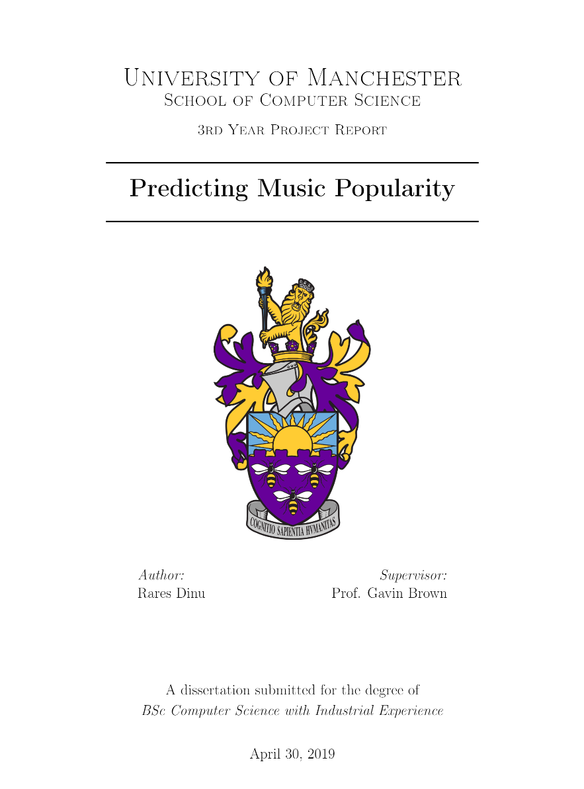

<h1 align="center">🎵 
  Predicting Music Popularity
</h1>
<h3 align="center">Code for the research for my <a href="https://github.com/pawKer/3rd_year_report/blob/master/compiled_pdf/RaresDinuDissertationFinal14.pdf" target="_blank">dissertation</a>.</h3>

 

## 🎯 Aim

I attempted to find out if there is a correlation between features of a song such as tempo, key, mode, etc. and its popularity. The data is from Spotify via the API and the Youtube views from their API. I'm using Python and libraries such as sklearn. I also want to find the model that has the best accuracy (or similar metric) of predicting whether a song can be popular or not.

## 🧪 Outcome

The full final disseration that outlines the research process and methods can be found [here](https://github.com/pawKer/3rd_year_report/blob/master/compiled_pdf/RaresDinuDissertationFinal14.pdf) and the web application which showcases some of the results of the research can be found [here](https://github.com/pawKer/predicting-popularity-webserver).

## 📜 Repository description

This repo also contains the data used for the research and the code for the web application (as a submodule).

I have tried to add inline comments along the way for ease of understanding. This is what each file is for:

- **3yp-main-py3** - Main notebook for research
- **3yp-data-plots** - Contains plots purely on the data
- **3yp-get-data-\*** - Scripts to get the data from the APIs
- **3yp-feature-selection** - Contains my attempts and algorithms for feature selection
- **3yp-prepare-model-for-web** - Export the models to files for the web application

## ⚙ Setup

To use the code that relies on the Spotify or Youtube APIs you will need to use your own credentials. Other than that if you have all the dependencies in the imports it should work for you as well.

I used Anaconda on Windows to run these Jupyter Notebooks. Unfortunately there is no `requirements.txt`.
